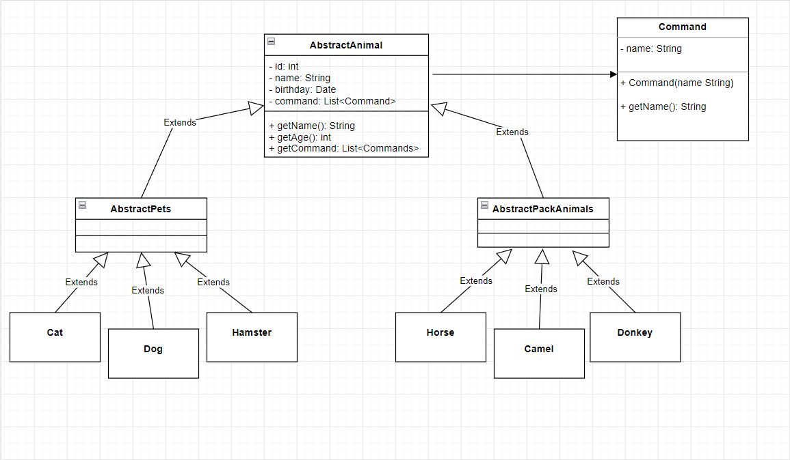

# Итоговая контрольная работа
## Информация о проекте
Необходимо организовать систему учета для питомника в котором живут
домашние и вьючные животные.
## Как сдавать проект
Для сдачи проекта необходимо создать отдельный общедоступный
репозиторий(Github, gitlub, или Bitbucket). Разработку вести в этом
репозитории, использовать пул реквесты на изменения. Программа должна
запускаться и работать, ошибок при выполнении программы быть не должно.
Программа, может использоваться в различных системах, поэтому необходимо
разработать класс в виде конструктора

### Задание
1. Используя команду cat в терминале операционной системы Linux, создать
   два файла Домашние животные (заполнив файл собаками, кошками,
   хомяками) и Вьючные животными заполнив файл Лошадьми, верблюдами и
   ослы), а затем объединить их. Просмотреть содержимое созданного файла.
   Переименовать файл, дав ему новое имя (Друзья человека).

      #### cat > pets.txt
   Собака  
   Кошка  
   Хомяк
      #### cat > pack_animals.txt
   Лошадь  
   Верблюд  
   Осел

      #### cat pets.txt pack_animals.txt > animals.txt
      #### cat animals.txt
   Собака  
   Кошка  
   Хомяк  
   Лошадь  
   Верблюд  
   Осел  
      #### mv animals.txt human_friends.txt
2. Создать директорию, переместить файл туда.
      #### mkdir animal
      #### mv human_friends.txt animal/
3. Подключить дополнительный репозиторий MySQL. Установить любой пакет
   из этого репозитория.
      #### sudo dpkg -i mysql-apt-config_0.8.25-1_all.deb
      #### sudo apt install mysql-server mysql-client
4. Установить и удалить deb-пакет с помощью dpkg.
      #### sudo wget https://dl.google.com/linux/direct/google-chrome-stable_current_amd64.deb
      #### sudo dpkg -i --force-depends google-chrome-stable_current_amd64.deb
      #### sudo dpkg -r google-chrome-stable
5. Выложить историю команд в терминале ubuntu
      

6. Нарисовать диаграмму, в которой есть класс родительский класс, домашние
   животные и вьючные животные, в составы которых в случае домашних
   животных войдут классы: собаки, кошки, хомяки, а в класс вьючные животные
   войдут: Лошади, верблюды и ослы).

   
